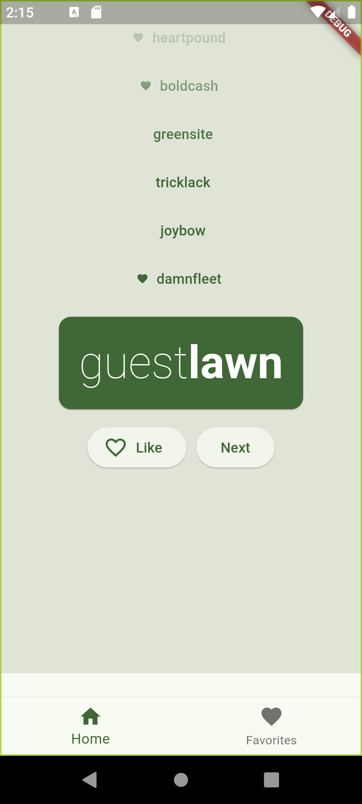
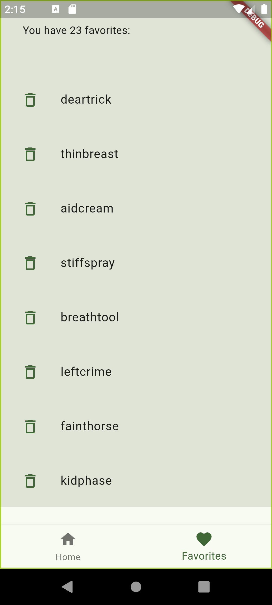

# Codelabs Flutter Example

This project is a Flutter example based on the official [Codelabs](https://codelabs.developers.google.com/) tutorials. It covers essential concepts and practices for building cross-platform mobile applications using Flutter.

## Features

- **Cross-platform development**: Works on both Android and iOS.
- **Simple UI**: Easy-to-understand design for beginners.
- **Codelab concepts**: Implements the core principles taught in Flutter Codelabs.

## Getting Started

1. Clone the repository:
   ```bash
   git clone https://github.com/ahmeth-sd/Codelabs-flutter-example.git
   ```

2. Navigate to the project directory:
   ```bash
   cd Codelabs-flutter-example
   ```

3. Install dependencies:
   ```bash
   flutter pub get
   ```

4. Run the app:
   ```bash
   flutter run
   ```

## Screenshots

Here are some screenshots from the application:





## Requirements

- Flutter 2.0 or later
- Dart 2.12 or later
- Android Studio or Visual Studio Code (with Flutter extension)

## License

This project is licensed under the MIT License - see the [LICENSE](LICENSE) file for details.
